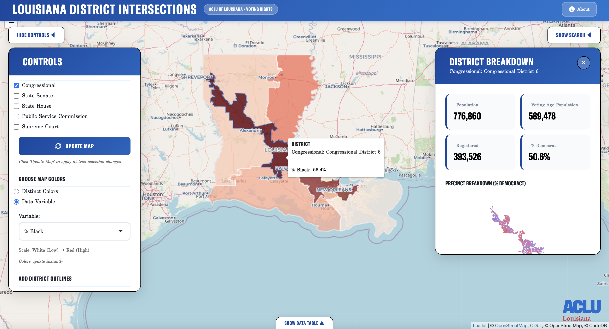

# Louisiana District Intersections Tool

An interactive R Shiny web application built by the **ACLU of Louisiana** for exploring how Louisiana's political districts overlap, and what those overlapping areas look like demographically and politically.



---

## What This Tool Does

Louisiana voters are simultaneously represented by multiple elected districts: Congressional, State Senate, State House, Public Service Commission, Louisiana Supreme Court, and beyond. This tool lets you select any combination of these district types and instantly see:

- **Where they overlap:** The precise precinct-level intersections between selected districts
- **Who lives there:** Total population, racial and ethnic demographics, and voting-age population
- **How they're registered:** Party registration breakdowns by race, including Democrat, Republican, and Other
- **How a specific intersection compares to the rest of Louisiana:** Side-by-side charts against statewide figures

There is also an **Individual Districts** mode that lets you pick two specific districts and see exactly which precincts fall in the intersection.

---

## Repository Structure

```
├── data_creation/
│   ├── data_creation.R              # Data processing pipeline
│   └── old_code/                    # Prior code before methodology update
|   |   ├── block_mapping.R
|   |   └── precinct_mapping.R
│   └── data/
│       ├── shapemaps/               # Input shapefiles (not all included)
│       └── voting_data/             # Voter registration data from LA Redistricting Portal
├── shiny/
│   ├── app.R                        # Full Shiny application (UI + server)
│   ├── precincts_clean_area.Rdata   # The cleaned data produced in data creation
│   └── www/
│       ├── style.css                # Custom CSS
│       └── *.ttf                    # GT America and Century Schoolbook fonts
├── images/
│   └── image.png                    # Screenshot used in README
├── README.md
└── districts.Rproj
```

**Note:** Not all raw shapefiles are included in this repository due to file size. See the Data Sources section below for download links.

---

## Data Processing Pipeline (`data_creation.R`)

The processing script takes raw spatial and voter data and produces the clean dataset that powers the Shiny app. 

### 1. Load Raw Data

The script loads seven spatial layers and one tabular file:

| Input | Source | Year |
|---|---|---|
| Louisiana parish boundaries | `tigris::counties()` | 2024 |
| Precinct shapefiles | [LA Redistricting Portal](https://redist.legis.la.gov/default_ShapeFiles2020) | 2026 (01/27/2026) |
| Precinct block equivalency + voter data | [LA Redistricting Portal](https://redist.legis.la.gov/2025%201RS/BlockEqu/LA_2026_01_VTD_DATA.zip) | 2026 (01/27/2026) |
| Congressional districts | [Census TIGER/Line](https://www2.census.gov/geo/tiger/TIGER2025/CD/) | 2025 |
| State Senate districts | `tigris::state_legislative_districts()` | 2025 |
| State House districts | `tigris::state_legislative_districts()` | 2025 |
| Public Service Commission districts | [LA Redistricting Portal](https://redist.legis.la.gov/2023_07/Adopted%20Plans%20From%20the%202022%201st%20Extraordinary%20Session/Public%20Service%20Commssion/) | 2023 |
| Louisiana Supreme Court districts | [LA Redistricting Portal](https://redist.legis.la.gov/2024_Files/2024LASSCAct7) | 2024 |
| Area water (all 64 parishes) | `tigris::area_water()` | 2025 |

### 2. Clean and Validate Geometries

All spatial layers are run through a `clean_geom()` function that:
- Repairs invalid geometries using `st_make_valid()`
- Reprojects everything to **Louisiana State Plane South (EPSG:3452)** for accurate area calculations in feet

Precincts with zero total population are dropped. Precinct geometries are then joined to the voter registration data (`LA_2026_01_VTD_DATA.txt`) by `UNITNUM`.

### 3. Remove Water

Census TIGER area water files are downloaded for all 64 Louisiana parishes, unioned into a single statewide water layer, and subtracted from precinct and district geometries using `st_difference()`. This step ensures that large water bodies don't inflate the apparent land area of precincts and distort district assignments.

### 4. Assign Each Precinct to a District

For each of the five district types, the script computes the **area-weighted overlap** between every precinct and every district, then assigns each precinct to whichever district it overlaps with most. This is done twice, once with water removed from geometries and once with water included, and the results are compared.

**Findings from the comparison:**
- For all five district types, the two approaches produced either identical or near-identical assignments
- The water-removed assignments were selected as the final method, as they better reflect land-based population distribution

A centroid-based method was also evaluated (assigning precincts based on where their geometric center falls) and compared against the area-weighted method. After the analysis, the area-weighted method was selected.

### 5. Produce the Output File

All five district assignments are joined back to the precinct geometries. The final dataset is simplified to 20% of its original vertex count using `rmapshaper::ms_simplify()` for faster web rendering, then saved as `precincts_clean_area.RData`.

The water layer is also saved separately as `water.RData` for potential use later on.

---

## Shiny Application (`app.R`)

The app is a single-file Shiny application built with Leaflet, Highcharter, and DT. It has two analysis modes.

### Mode 1: Statewide Grouping

Select any combination of the five district types and click **Update Map**. The app groups precincts by every unique combination of selected districts and dissolves their geometries into a single polygon per group. Demographic and registration totals are aggregated across all precincts in each group, and percentages are recalculated from those aggregated totals.

The map can be colored two ways:
- **Distinct Colors:** Uses a graph-coloring algorithm to ensure adjacent polygons never share a color, using up to 5 colors.
- **Data Variable:** Colors each polygon on a white-to-red gradient based on any demographic or registration variable.

Clicking a polygon opens a right sidebar with:
- Summary stats (population, VAP, registered voters, % Democrat)
- A mini Leaflet map of the individual precincts within that intersection, colored by % Democrat
- Party registration column chart
- Demographic composition column chart
- A horizontal bar chart comparing the district's percentages against the Louisiana statewide figures

### Mode 2: Individual Districts

Select a specific district from two different district types. The app computes three precinct subsets:

- **Intersection:** Precincts in both District A and District B (purple on the map)
- **A only:** Precincts in District A but not District B (blue)
- **B only:** Precincts in District B but not District A (red)

A floating results panel shows aggregated statistics for each of the three zones.

### Search

- **Address search:** Geocodes any Louisiana address using the Nominatim API and drops a pin on the map.
- **District search:** Filters to a specific district number within any district type, highlights its boundary on the map for 6 seconds, and zooms to it.

### Data Table and Download

A collapsible drawer at the bottom of the app shows the full intersection dataset. Any filtered view can be downloaded as a CSV.

---
## Disclaimer

Precinct-to-district assignments are based on area-weighted overlap. A small number of precincts, particularly those that straddle district boundaries, may be assigned to the wrong district. All data aggregations in this tool are **estimates** and are **not official figures**. Results should not be used as a substitute for official election or census data.

---

## Contact

Developed by the ACLU of Louisiana. For questions or feedback, contact: **eappelson@laaclu.org**

---

## Future

- [ ] Make mobile-friendly
- [ ] Optimize performance (faster initial load)
- [ ] Add historical election results overlay
